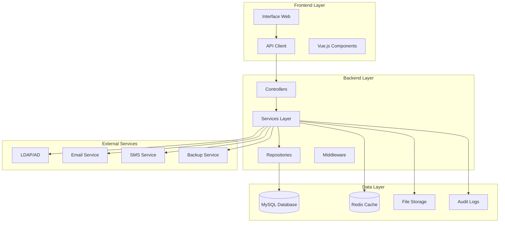

# Design Document: Sistema Avançado de Gestão de Utilizadores

## Overview

Este documento descreve o design técnico e arquitetural para implementar um sistema avançado de gestão de utilizadores na plataforma Hemera Capital Partners. O sistema será construído sobre a base Laravel existente, expandindo as funcionalidades atuais com recursos empresariais modernos.

## Architecture

### Arquitetura Geral



### Estrutura de Módulos

```
app/Modules/UserManagement/
├── Controllers/
│   ├── UserController.php
│   ├── RoleController.php
│   ├── PermissionController.php
│   ├── ImportExportController.php
│   └── ReportController.php
├── Services/
│   ├── UserService.php
│   ├── RolePermissionService.php
│   ├── ImportExportService.php
│   ├── AuditService.php
│   ├── ReportService.php
│   └── IntegrationService.php
├── Models/
│   ├── User.php (extended)
│   ├── Role.php
│   ├── Permission.php
│   ├── UserGroup.php
│   ├── AuditLog.php
│   └── UserProfile.php
├── Repositories/
│   ├── UserRepository.php
│   ├── RoleRepository.php
│   └── AuditRepository.php
├── Requests/
│   ├── CreateUserRequest.php
│   ├── UpdateUserRequest.php
│   ├── BulkActionRequest.php
│   └── ImportUsersRequest.php
├── Resources/
│   ├── UserResource.php
│   ├── UserListResource.php
│   └── UserDetailResource.php
├── Jobs/
│   ├── ImportUsersJob.php
│   ├── ExportUsersJob.php
│   ├── SendWelcomeEmailJob.php
│   └── SyncLdapUsersJob.php
└── Events/
    ├── UserCreated.php
    ├── UserUpdated.php
    ├── UserDeleted.php
    └── BulkActionPerformed.php
```

## Components and Interfaces

### 1. Enhanced User Model

```php
class User extends Authenticatable
{
    protected $fillable = [
        'name', 'email', 'password', 'birth_date', 'phone', 
        'department', 'position', 'hire_date', 'status', 
        'avatar', 'last_login_at', 'email_verified_at'
    ];

    protected $casts = [
        'birth_date' => 'date',
        'hire_date' => 'date',
        'last_login_at' => 'datetime',
        'email_verified_at' => 'datetime',
        'is_admin' => 'boolean',
        'status' => UserStatus::class
    ];

    // Relationships
    public function roles(): BelongsToMany
    public function groups(): BelongsToMany
    public function auditLogs(): HasMany
    public function profile(): HasOne
    
    // Scopes
    public function scopeActive($query)
    public function scopeByRole($query, $role)
    public function scopeByDepartment($query, $department)
    public function scopeSearch($query, $term)
}
```

### 2. Role and Permission System

```php
class Role extends Model
{
    protected $fillable = ['name', 'description', 'is_system'];
    
    public function permissions(): BelongsToMany
    public function users(): BelongsToMany
}

class Permission extends Model
{
    protected $fillable = ['name', 'module', 'description'];
    
    public function roles(): BelongsToMany
}

class UserGroup extends Model
{
    protected $fillable = ['name', 'description', 'type'];
    
    public function users(): BelongsToMany
}
```

### 3. Advanced Search and Filter Service

```php
class UserSearchService
{
    public function search(array $filters): LengthAwarePaginator
    {
        $query = User::query();
        
        // Text search
        if (!empty($filters['search'])) {
            $query->where(function($q) use ($filters) {
                $q->where('name', 'like', "%{$filters['search']}%")
                  ->orWhere('email', 'like', "%{$filters['search']}%")
                  ->orWhere('phone', 'like', "%{$filters['search']}%");
            });
        }
        
        // Status filter
        if (!empty($filters['status'])) {
            $query->where('status', $filters['status']);
        }
        
        // Role filter
        if (!empty($filters['role'])) {
            $query->whereHas('roles', function($q) use ($filters) {
                $q->where('name', $filters['role']);
            });
        }
        
        // Department filter
        if (!empty($filters['department'])) {
            $query->where('department', $filters['department']);
        }
        
        // Date range filter
        if (!empty($filters['date_from'])) {
            $query->where('created_at', '>=', $filters['date_from']);
        }
        
        // Sorting
        $sortField = $filters['sort_by'] ?? 'created_at';
        $sortDirection = $filters['sort_direction'] ?? 'desc';
        $query->orderBy($sortField, $sortDirection);
        
        return $query->paginate($filters['per_page'] ?? 25);
    }
}
```

### 4. Import/Export Service

```php
class ImportExportService
{
    public function exportUsers(array $filters = [], string $format = 'csv'): string
    {
        $users = $this->userSearchService->search($filters);
        
        switch ($format) {
            case 'csv':
                return $this->exportToCsv($users);
            case 'excel':
                return $this->exportToExcel($users);
            default:
                throw new InvalidArgumentException("Unsupported format: {$format}");
        }
    }
    
    public function importUsers(UploadedFile $file): ImportResult
    {
        $data = $this->parseFile($file);
        $results = new ImportResult();
        
        foreach ($data as $row) {
            try {
                $this->validateRow($row);
                $user = $this->createUserFromRow($row);
                $results->addSuccess($user);
                
                // Dispatch welcome email job
                SendWelcomeEmailJob::dispatch($user);
                
            } catch (ValidationException $e) {
                $results->addError($row, $e->getMessage());
            }
        }
        
        return $results;
    }
    
    public function getImportTemplate(): string
    {
        $headers = [
            'name', 'email', 'phone', 'department', 
            'position', 'hire_date', 'role', 'status'
        ];
        
        return $this->generateCsvTemplate($headers);
    }
}
```

### 5. Audit Service

```php
class AuditService
{
    public function logUserAction(string $action, User $user, array $changes = []): void
    {
        AuditLog::create([
            'user_id' => $user->id,
            'action' => $action,
            'changes' => $changes,
            'ip_address' => request()->ip(),
            'user_agent' => request()->userAgent(),
            'performed_by' => auth()->id(),
            'performed_at' => now()
        ]);
    }
    
    public function getUserActivityLog(User $user): Collection
    {
        return AuditLog::where('user_id', $user->id)
            ->orderBy('performed_at', 'desc')
            ->get();
    }
    
    public function getSystemAuditLog(array $filters = []): LengthAwarePaginator
    {
        $query = AuditLog::with(['user', 'performedBy']);
        
        if (!empty($filters['action'])) {
            $query->where('action', $filters['action']);
        }
        
        if (!empty($filters['user_id'])) {
            $query->where('user_id', $filters['user_id']);
        }
        
        if (!empty($filters['date_from'])) {
            $query->where('performed_at', '>=', $filters['date_from']);
        }
        
        return $query->orderBy('performed_at', 'desc')->paginate(50);
    }
}
```

### 6. Bulk Actions Service

```php
class BulkActionService
{
    public function performBulkAction(string $action, array $userIds, array $params = []): BulkActionResult
    {
        $result = new BulkActionResult();
        
        foreach ($userIds as $userId) {
            try {
                $user = User::findOrFail($userId);
                
                switch ($action) {
                    case 'activate':
                        $this->activateUser($user);
                        break;
                    case 'deactivate':
                        $this->deactivateUser($user);
                        break;
                    case 'delete':
                        $this->deleteUser($user);
                        break;
                    case 'change_role':
                        $this->changeUserRole($user, $params['role']);
                        break;
                    case 'reset_password':
                        $this->resetUserPassword($user);
                        break;
                }
                
                $result->addSuccess($user);
                
            } catch (Exception $e) {
                $result->addError($userId, $e->getMessage());
            }
        }
        
        // Log bulk action
        $this->auditService->logBulkAction($action, $userIds, $result);
        
        return $result;
    }
}
```

## Data Models

### Database Schema Extensions

```sql
-- Extended users table
ALTER TABLE users ADD COLUMN phone VARCHAR(20) NULL;
ALTER TABLE users ADD COLUMN department VARCHAR(100) NULL;
ALTER TABLE users ADD COLUMN position VARCHAR(100) NULL;
ALTER TABLE users ADD COLUMN hire_date DATE NULL;
ALTER TABLE users ADD COLUMN status ENUM('active', 'inactive', 'pending', 'blocked', 'suspended') DEFAULT 'active';
ALTER TABLE users ADD COLUMN avatar VARCHAR(255) NULL;

-- Roles table
CREATE TABLE roles (
    id BIGINT UNSIGNED AUTO_INCREMENT PRIMARY KEY,
    name VARCHAR(100) NOT NULL UNIQUE,
    description TEXT NULL,
    is_system BOOLEAN DEFAULT FALSE,
    created_at TIMESTAMP NULL,
    updated_at TIMESTAMP NULL
);

-- Permissions table
CREATE TABLE permissions (
    id BIGINT UNSIGNED AUTO_INCREMENT PRIMARY KEY,
    name VARCHAR(100) NOT NULL UNIQUE,
    module VARCHAR(50) NOT NULL,
    description TEXT NULL,
    created_at TIMESTAMP NULL,
    updated_at TIMESTAMP NULL
);

-- Role-Permission pivot
CREATE TABLE role_permissions (
    role_id BIGINT UNSIGNED,
    permission_id BIGINT UNSIGNED,
    PRIMARY KEY (role_id, permission_id),
    FOREIGN KEY (role_id) REFERENCES roles(id) ON DELETE CASCADE,
    FOREIGN KEY (permission_id) REFERENCES permissions(id) ON DELETE CASCADE
);

-- User-Role pivot
CREATE TABLE user_roles (
    user_id BIGINT UNSIGNED,
    role_id BIGINT UNSIGNED,
    assigned_at TIMESTAMP DEFAULT CURRENT_TIMESTAMP,
    assigned_by BIGINT UNSIGNED NULL,
    PRIMARY KEY (user_id, role_id),
    FOREIGN KEY (user_id) REFERENCES users(id) ON DELETE CASCADE,
    FOREIGN KEY (role_id) REFERENCES roles(id) ON DELETE CASCADE,
    FOREIGN KEY (assigned_by) REFERENCES users(id) ON DELETE SET NULL
);

-- User groups
CREATE TABLE user_groups (
    id BIGINT UNSIGNED AUTO_INCREMENT PRIMARY KEY,
    name VARCHAR(100) NOT NULL,
    description TEXT NULL,
    type ENUM('department', 'team', 'custom') DEFAULT 'custom',
    created_at TIMESTAMP NULL,
    updated_at TIMESTAMP NULL
);

-- User-Group pivot
CREATE TABLE user_group_members (
    user_id BIGINT UNSIGNED,
    group_id BIGINT UNSIGNED,
    joined_at TIMESTAMP DEFAULT CURRENT_TIMESTAMP,
    PRIMARY KEY (user_id, group_id),
    FOREIGN KEY (user_id) REFERENCES users(id) ON DELETE CASCADE,
    FOREIGN KEY (group_id) REFERENCES user_groups(id) ON DELETE CASCADE
);

-- Audit logs
CREATE TABLE audit_logs (
    id BIGINT UNSIGNED AUTO_INCREMENT PRIMARY KEY,
    user_id BIGINT UNSIGNED NULL,
    action VARCHAR(100) NOT NULL,
    changes JSON NULL,
    ip_address VARCHAR(45) NULL,
    user_agent TEXT NULL,
    performed_by BIGINT UNSIGNED NULL,
    performed_at TIMESTAMP DEFAULT CURRENT_TIMESTAMP,
    INDEX idx_user_id (user_id),
    INDEX idx_action (action),
    INDEX idx_performed_at (performed_at),
    FOREIGN KEY (user_id) REFERENCES users(id) ON DELETE SET NULL,
    FOREIGN KEY (performed_by) REFERENCES users(id) ON DELETE SET NULL
);

-- User profiles (extended information)
CREATE TABLE user_profiles (
    id BIGINT UNSIGNED AUTO_INCREMENT PRIMARY KEY,
    user_id BIGINT UNSIGNED UNIQUE,
    bio TEXT NULL,
    skills JSON NULL,
    preferences JSON NULL,
    emergency_contact JSON NULL,
    created_at TIMESTAMP NULL,
    updated_at TIMESTAMP NULL,
    FOREIGN KEY (user_id) REFERENCES users(id) ON DELETE CASCADE
);

-- Password history (for policy enforcement)
CREATE TABLE password_history (
    id BIGINT UNSIGNED AUTO_INCREMENT PRIMARY KEY,
    user_id BIGINT UNSIGNED,
    password_hash VARCHAR(255),
    created_at TIMESTAMP DEFAULT CURRENT_TIMESTAMP,
    FOREIGN KEY (user_id) REFERENCES users(id) ON DELETE CASCADE
);

-- Login attempts (security)
CREATE TABLE login_attempts (
    id BIGINT UNSIGNED AUTO_INCREMENT PRIMARY KEY,
    email VARCHAR(255),
    ip_address VARCHAR(45),
    success BOOLEAN,
    attempted_at TIMESTAMP DEFAULT CURRENT_TIMESTAMP,
    INDEX idx_email (email),
    INDEX idx_ip_address (ip_address),
    INDEX idx_attempted_at (attempted_at)
);
```

## Error Handling

### Exception Classes

```php
class UserManagementException extends Exception {}
class UserNotFoundException extends UserManagementException {}
class InvalidUserDataException extends UserManagementException {}
class BulkActionException extends UserManagementException {}
class ImportValidationException extends UserManagementException {}
class PermissionDeniedException extends UserManagementException {}
```

### Error Response Format

```php
class ErrorResponse
{
    public static function format(Exception $e): array
    {
        return [
            'success' => false,
            'error' => [
                'type' => class_basename($e),
                'message' => $e->getMessage(),
                'code' => $e->getCode(),
                'details' => method_exists($e, 'getDetails') ? $e->getDetails() : null
            ],
            'timestamp' => now()->toISOString()
        ];
    }
}
```

## Testing Strategy

### Unit Tests

```php
class UserServiceTest extends TestCase
{
    public function test_can_create_user_with_valid_data()
    public function test_cannot_create_user_with_duplicate_email()
    public function test_can_search_users_by_name()
    public function test_can_filter_users_by_status()
    public function test_can_assign_role_to_user()
    public function test_can_perform_bulk_actions()
    public function test_can_import_users_from_csv()
    public function test_can_export_users_to_csv()
}

class RolePermissionServiceTest extends TestCase
{
    public function test_can_create_role_with_permissions()
    public function test_can_check_user_permissions()
    public function test_can_inherit_permissions_from_multiple_roles()
}

class AuditServiceTest extends TestCase
{
    public function test_logs_user_creation()
    public function test_logs_user_updates()
    public function test_logs_bulk_actions()
}
```

### Integration Tests

```php
class UserManagementIntegrationTest extends TestCase
{
    public function test_complete_user_lifecycle()
    public function test_import_export_workflow()
    public function test_role_permission_workflow()
    public function test_audit_trail_completeness()
}
```

### Feature Tests

```php
class UserManagementFeatureTest extends TestCase
{
    public function test_admin_can_manage_users()
    public function test_search_and_filter_functionality()
    public function test_bulk_actions_interface()
    public function test_import_export_interface()
    public function test_role_management_interface()
}
```

## Performance Considerations

### Database Optimization

1. **Indexing Strategy**
   - Composite indexes on frequently filtered columns
   - Full-text search indexes for name/email searches
   - Partitioning for audit logs by date

2. **Query Optimization**
   - Eager loading for relationships
   - Query result caching for static data
   - Database query optimization for complex filters

3. **Caching Strategy**
   - Redis caching for user permissions
   - Cache user search results
   - Cache role and permission data

### Frontend Optimization

1. **Lazy Loading**
   - Paginated results with infinite scroll
   - Lazy load user details on demand
   - Progressive image loading for avatars

2. **Real-time Updates**
   - WebSocket connections for live updates
   - Optimistic UI updates
   - Background sync for offline changes

## Security Measures

### Authentication & Authorization

1. **Multi-factor Authentication**
2. **Role-based Access Control (RBAC)**
3. **Permission-based Authorization**
4. **Session Management**

### Data Protection

1. **Input Validation & Sanitization**
2. **SQL Injection Prevention**
3. **XSS Protection**
4. **CSRF Protection**
5. **Data Encryption at Rest**

### Audit & Monitoring

1. **Comprehensive Audit Logging**
2. **Security Event Monitoring**
3. **Failed Login Attempt Tracking**
4. **Suspicious Activity Detection**

## Deployment Strategy

### Environment Configuration

```php
// config/user-management.php
return [
    'pagination' => [
        'default_per_page' => 25,
        'max_per_page' => 100,
    ],
    'import' => [
        'max_file_size' => '10MB',
        'allowed_formats' => ['csv', 'xlsx'],
        'batch_size' => 1000,
    ],
    'security' => [
        'password_policy' => [
            'min_length' => 8,
            'require_uppercase' => true,
            'require_lowercase' => true,
            'require_numbers' => true,
            'require_symbols' => true,
        ],
        'login_attempts' => [
            'max_attempts' => 5,
            'lockout_duration' => 30, // minutes
        ],
    ],
    'notifications' => [
        'welcome_email' => true,
        'password_reset_email' => true,
        'account_locked_email' => true,
    ],
];
```

### Migration Strategy

1. **Phase 1**: Database schema updates
2. **Phase 2**: Backend service implementation
3. **Phase 3**: Frontend interface updates
4. **Phase 4**: Testing and validation
5. **Phase 5**: Production deployment with feature flags

### Monitoring & Maintenance

1. **Application Performance Monitoring (APM)**
2. **Database Performance Monitoring**
3. **Error Tracking and Alerting**
4. **Regular Security Audits**
5. **Automated Backup Verification**